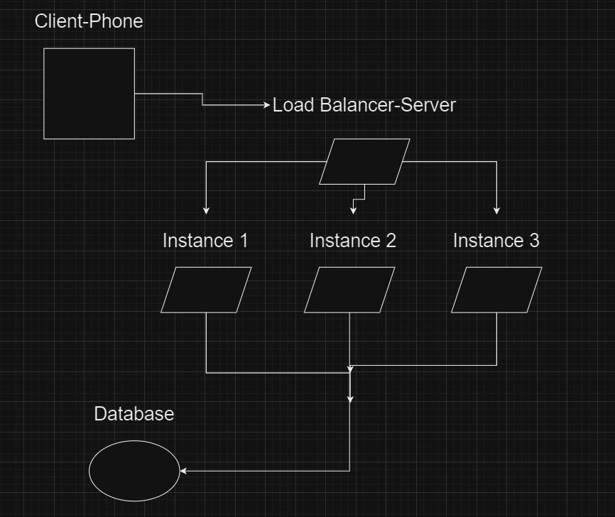

# Game Leaderboard Backend - Nodejs + Redis

## Overview

This README provides a comprehensive guide to the backend application, covering its architecture, setup, and usage. The load balancer configuration ensures scalability, while MongoDB and Redis support efficient data management and real-time leaderboard operations.

This backend application is designed for a high-traffic game leaderboard system, capable of handling thousands of active players. The leaderboard ranks players based on the money they've earned since the start of the week and resets weekly. The top 100 players are rewarded with in-game currency according to their rankings.


## Technologies Used

- **Node.js**: Server-side JavaScript runtime for building scalable network applications.
- **MongoDB Atlas**: Cloud-based NoSQL database for storing player profiles and other infrequently changing data.
- **Redis**: In-memory data structure store used for fast, real-time leaderboard operations.
- **Nginx**: Web server and load balancer, distributing incoming requests across multiple Node.js instances.
- **Winston & Morgan**: Logging libraries used to log important activities and request information in the application.

## Architecture




### MongoDB

MongoDB is utilized for storing player information that doesn't require frequent updates:

- **Player Data**:
  - `playerId`: Unique identifier for each player.
  - `name`: Player's display name.
  - `country`: Player's country of origin.
  - `yesterdayRank`: The player's rank as of the previous day, calculated daily at 23:59:59.
  - `totalPrize`: The cumulative prize money a player has earned, updated weekly at 23:59:59 on Sundays.

### Redis

Redis handles data that requires rapid read/write operations:

- **Leaderboard Data**: Player rankings are stored in Redis due to their dynamic nature, involving continuous updates and calculations.
- **Real-time Operations**: Redis enables quick retrieval and updating of player rankings and earnings without the overhead of disk I/O.

## Installation and Setup

### Prerequisites

- **Node.js**: Ensure you have Node.js installed (version 14.x or higher recommended).
- **Redis**: Install Redis on your system.
- **MongoDB Atlas Account**: Set up a MongoDB Atlas account and obtain your connection string.

### Steps

1. **Clone the Repository**

   ```bash
   git clone <repository-url>
   cd <repository-directory>
   ```

2. **Install Dependencies**

   ```bash
   npm install
   ```

3. **Configure Environment Variables**

   - Create a `.env` file in the root directory.
   - Add the following environment variables:

     ```env
     MONGODB_URI=<your-mongodb-atlas-connection-string>
     REDIS_HOST=localhost
     REDIS_PORT=6379
     ```

4. **Start Redis Server**

   - **For Ubuntu/Debian-based systems:**

     ```bash
     sudo apt update
     sudo apt install redis-server
     sudo service redis-server start
     ```

   - **For macOS (using Homebrew):**

     ```bash
     brew install redis
     brew services start redis
     ```

5. **Run the Application**

   ```bash
   npm start
   ```

## Features

- **Real-time Leaderboard Updates**

  - Utilizes Redis for high-performance leaderboard operations.
  - Rankings are recalculated on-the-fly when fetching the leaderboard or updating a player's earnings.

- **Player Profile Management**

  - Stores player profiles in MongoDB, including `playerId`, `name`, `country`, `yesterdayRank`, and `totalPrize`.
  - `yesterdayRank` is updated daily, while `totalPrize` is updated weekly.

- **Scheduled Tasks**

  - **Daily Updates**: Calculates `yesterdayRank` for all players daily at 23:59:59.
  - **Weekly Updates**: Updates `totalPrize` weekly on Sundays at 23:59:59.

## API Endpoints

- **GET `/api/leaderboard`**

  - Retrieves the top 100 players.
  - Also returns the requesting player's rank, along with the three players above and two players below them.

- **POST `/api/earnings`**

  - Updates a player's earnings.
  - Recalculates the player's rank and stores the daily difference.

## Important Notes

- **Dynamic Rankings**

  - Player rankings are not stored persistently due to their highly dynamic nature.
  - Calculations are performed as needed to ensure up-to-date information.

- **Performance Optimization**

  - Combining MongoDB and Redis allows the system to handle both infrequent and continuous data operations efficiently.
  - This architecture supports horizontal scalability to accommodate a large number of active players.

## License

This project is licensed under the MIT License.

---

